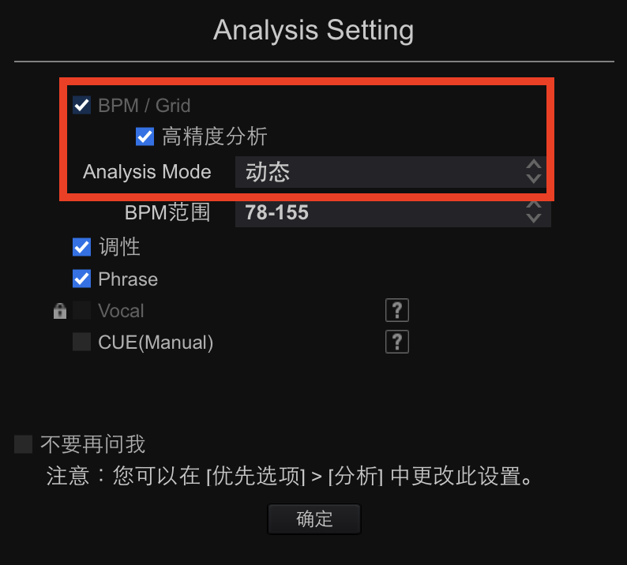

[简体中文](README_zh.md) | English
# r2s-beatgrid (MP3 only)

Python script that writes beat information from **Rekordbox XML** into **Serato BeatGrid**.

Many classic and live-feel tracks (disco, funk, soul, rock, old-school hip-hop, etc.) do not keep a perfectly constant tempo. That makes tight looping, time-based FX and Sync tricky in Serato unless the Beatgrid is prepared carefully. Rekordbox can analyze **variable tempo** via its **Dynamic** track-analysis mode and produce a flexible grid that follows tempo drift. This script lets you take those Rekordbox-generated beat anchors and write them into the **MP3** so Serato can use the same precise bar‑1 downbeats and BPM changes.

> ⚠️ MP3 only. WAV / AIFF / FLAC / ALAC grids live in Serato’s `_Serato_/Database V2` and are not modified by this tool.  
> 🔄 Back up your MP3s before processing.

---

## Features
| Feature | Details |
|---|---|
| Accurate bar markers | Writes Serato red-line BeatGrid at each bar‑1 downbeat based on Rekordbox anchors |
| Batch XML | Accepts Rekordbox XML containing multiple `<TRACK>` entries |
| Offline and safe | Touches only MP3 tags (Serato BeatGrid GEOB + TBPM); does not touch Serato’s database |

---

## Requirements
| Component | Version / Notes |
|---|---|
| OS | Windows 10+ / macOS 10.15+ / Linux |
| Python | 3.7+ |
| Python deps | `serato-tools`, `mutagen` |

---

## Terminology: Rekordbox analysis modes
- **Normal** — analyzes toward a single BPM target range you choose.  
- **Dynamic** — analyzes for **tempo changes** and produces a **flexible beatgrid** when tempo drifts; recommended for live‑drummed or older tracks.

To export your grid to XML: **File → Export Collection in xml format…**.

Serato Beatgrids drive Sync, Quantize, loops, and time‑based FX—so accuracy matters.

---

## Workflow (parallel preparation, horizontal)


---

## Step‑by‑step

### 0) Back up
Copy all target MP3s to a safe location before you start.

### 1) Rekordbox — analyze and export XML
1. Drag the target MP3s into the **Rekordbox** collection.  
2. In the Analysis dialog (or Preferences → Analysis → Track Analysis), set **Track Analysis Mode = Dynamic** and ensure **BPM / Grid** is selected; run analysis.  
3. Export the library XML via **File → Export Collection in xml format…** (e.g., `rekordbox_export.xml`).

Optional screenshot placeholders (if you add images to `PIC/`):  
`

### 2) Serato — write initial tags
1. Open **Serato DJ Pro** and create a crate (e.g., `GridPrep`).  
2. Drag the **same** MP3s into that crate.  
3. Click **Analyze Files** with **Key & Waveform only** (Beatgrid unchecked) to write Serato’s initial tags (gain, overview, etc.).

Optional screenshot placeholder:  
- ``

### 3) Install (one‑time)
```bash
git clone https://github.com/<your-username>/r2s-beatgrid.git
cd r2s-beatgrid

# Create a virtual env
python3 -m venv venv

# Activate it (do this before running each time)
# macOS/Linux:
source venv/bin/activate
# Windows (cmd):
# venv\Scripts\activate

# Install deps
pip install -r requirements.txt
# Includes: serato-tools>=0.4.0 and mutagen>=1.47
```

### 4) Run the script
```bash
python r2s.py "/full/path/to/rekordbox_export.xml"
```

Example output:
```
--> Reading XML: /Users/me/exports/rb.xml
→ Processing: Superstition (Superstition.mp3), 112 bars
✅ Wrote BeatGrid & BPM=99.99 to 'Superstition.mp3'
```

### 5) Verify in Serato
Reload each track in Serato. You should see bar‑1 downbeats aligned and BPM changing over time (like in Rekordbox). Sync, Quantize, loops, and time‑based FX should now lock correctly.

---

Happy mixing!
