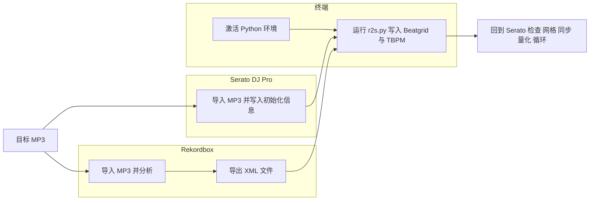
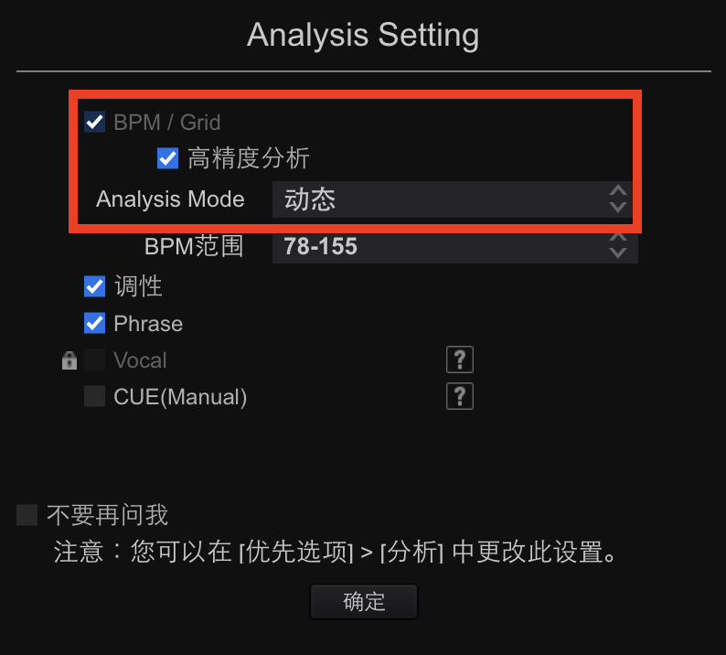
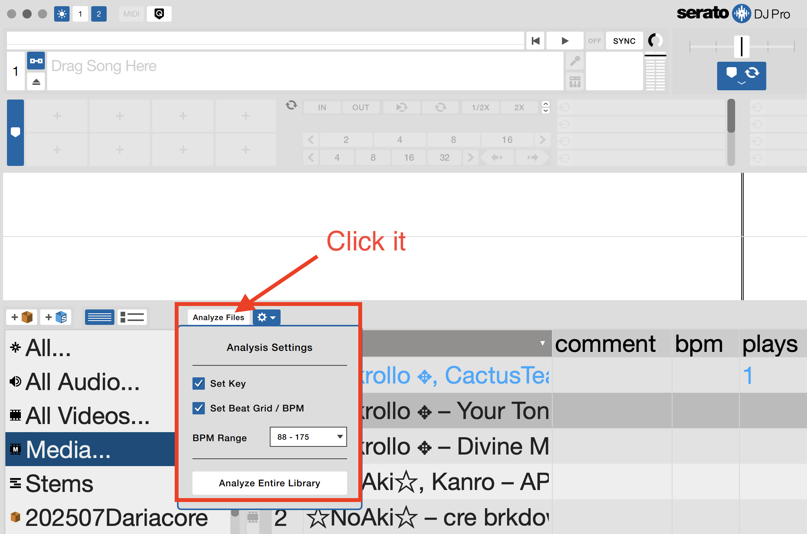

[English](README.md) | 简体中文

# r2s-beatgrid (只支持MP3)

Python script to write beat information from **Rekordbox XML** to **Serato BeatGrid**

在 DJ 软件领域，Serato 与 Rekordbox 平分秋色。
Serato 深受那些偏好用唱机、战斗布局控制器的 DJ 欢迎，尤其是在 Hip-Hop、Funk、R&B、Reggae 等更强调律动、节奏变化与现场表现的音乐类型中，Serato 的用户占比显著更高。
然而，恰恰是这些经典的音乐风格（Old School Hip-Hop、Funk、Soul、Blues、经典摇滚等）往往伴随节奏的自然变化和律动的波动，而 Serato 本身并不支持变速节拍网格。

这导致 Serato 用户在面对这些“天然含有变速”的经典音乐时，经常感到力不从心，需要演奏者手动花费大量精力去调整节拍网格。

相比之下，Rekordbox 对变速节拍的支持极为出色，它能精准地分析出这些音乐的拍点变化与律动细节，甚至几乎不需要修正就能直接演奏。

通过我编写的程序（脚本），从此你可以一键将 Rekordbox 针对每首歌生成的节拍锚点，自动转换并写入到相应 MP3 文件中，使 Serato 同样拥有 Rekordbox 一样的高精度变速节拍网格。

注意，这并不是什么新的技术，已有数个商业软件具备这样的节拍网格转换能力，但我认为他们工作的方式都过于复杂，不仅要安装并接触你所有的 DJ 软件数据库，同时还要联网访问，这或许会叫人担忧隐私。此外你还必须每月至少花上 7 美元才能获得这种服务。


> ⚠️ **目前仅支持 MP3。** WAV / AIFF / FLAC / ALAC 等无损文件的网格依然存于 `_Serato_/Database V2`，脚本不会修改它们。  
> 🔄 **操作前请务必备份所有待处理 MP3！**

---

## ✨ 功能概览
| 功能 | 说明 |
|------|------|
| 🎯 精准网格 | 按每小节第一拍写入 Serato 的红线 BeatGrid |
| 🔄 批量处理 | 支持含多首 `<TRACK>` 的 Rekordbox XML |
| 🛡️ 安全离线 | 仅修改 MP3 内部标签，不接触 Serato 数据库 |

---

## 🖥️ 环境要求

| 组件 | 版本 / 说明 |
|------|-------------|
| 操作系统 | Windows 10+ / macOS 10.15+ / Linux |
| Python | 3.7 及以上 |
| 依赖 | `serato-tools` · `mutagen` |




## 🚀 使用步骤（建议一次性照做）


### 0 · 备份
> **强烈建议：在开始之前，把所有待处理 MP3 复制到安全位置！**

### 1 · Rekordbox 侧：分析并导出 XML


1. 将目标 MP3 拖入 Rekordbox 曲库  

3. 在弹出菜单中选“动态”+“高精度”(如图)
4. 分析完成后，菜单 **File ▸ Export Collection in XML Format…**  
   - 保存为 带节拍网格的`.xml`

### 2 · Serato 侧：写入「初始化」信息

1. 启动 Serato → 左栏 **+** 创建一个新 Crate，例如 `GridPrep`  
2. 把同样的 MP3 全部拖入该 Crate

4. 点击 **Analyze Files**  (如图)
   - 仅勾选 **Key** 与 **Waveform**，**取消 Beatgrid**  
5. 等待分析结束 —— 这一步会为每首歌写入 Serato 所需的「初始化」标签（增益、概览等）

### 3 · 安装脚本及依赖

```bash
git clone https://github.com/<your‑username>/r2s-beatgrid.git
cd r2s-beatgrid

# 创建环境
python3 -m venv venv

# 激活环境（以后每次运行都从这里开始）
source venv/bin/activate        # Windows: venv\Scripts\activate

# 安装依赖
pip install -r requirements.txt

（包含serato-tools>=0.4.0
mutagen>=1.47）


### 4 · 运行脚本

```bash
python r2s.py /完整/路径/到/rekordbox_export.xml（拖入rb分析完导出的xml）
```

运行示例：
```
--> 读取 XML：/Users/me/exports/rb.xml
→ 处理: Superstition (Superstition.mp3) ，共 112 个小节
✅ 已写入 BeatGrid & BPM=99.99 到 'Superstition.mp3'
```

### 5 · 在 Serato 中验证

1. 重新载入相应曲目，应该能看到每小节第一拍是红线，并且bpm会像RB一样动态改变。

---

Happy mixing!
